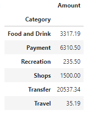
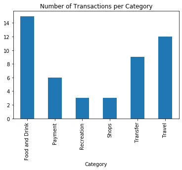
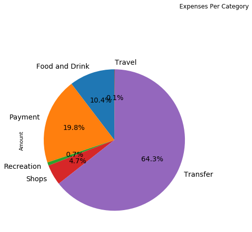
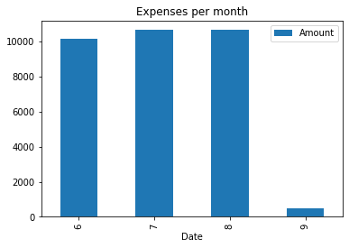
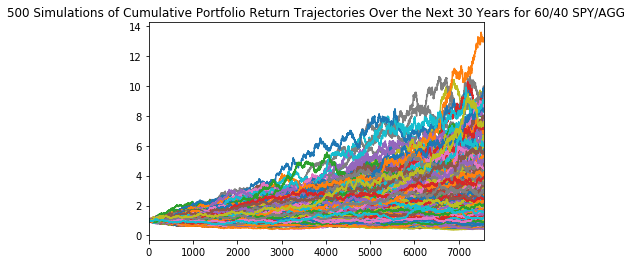

## Budget Analysis for the last 90 Days
Summarize the transaction data from the budget analysis and include images for each chart and table produced.

### Expenses per Category
There is a large distribution of expenses in the Transfer category.   
There is also a large number of transactions in the Food and Drink category  

### Total Expenses per Category Pie Chart

 

### Expenses per Month
Monthly expenses are steady from month to month over the last 90 days as seen in the chart below:

---

## **Retirement Planning**

### **Portfolio Predictions**

The portfolio chosen is the standard 60/40 Stock/Bond split, with 60% SPDR S&P 500 Trust ETF (SPY), and 40% U.S. Aggregate Bond ETF (AGG).  With this portfolio we have run 500, 30-year simulations in order to accurately predict  the potential earning within a 90% confidence.

#### **Monte Carlo Conclusions**

The expected portfolio returns for initial investment of 20,000 over the next 30 Years will end within in the range of:  
90th percentile: 28,012  
50th percentile: 53,318   
10th percentile: 106,538  
 
With a standard 4% withdrawal of 4,261 the yearly income will be less than the 6,058 Projected Yearly Income from the Plaid Analysis

#### *Alternative Option*
If the initial investment is increase by 50% to 30,000 over the next 30 Years, the investment is projected to end within in the range of: 
10th percentile: 159,807 
With a standard 4% withdrawal of 6,392 being more than the 6,058 Projected Yearly Income from the Plaid Analysis.

**We highly recommend an increase to the initial investment in order to realize the retirement goals in the next 30 years.**

---